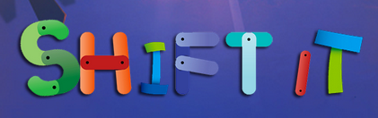
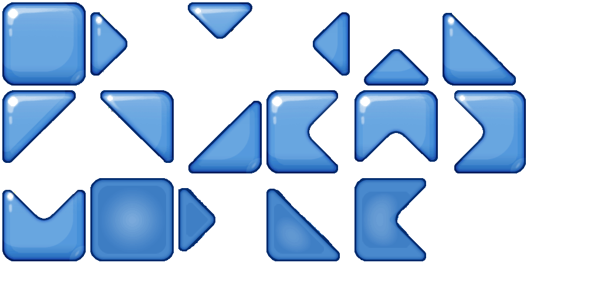
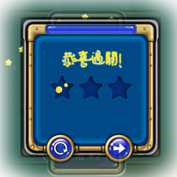
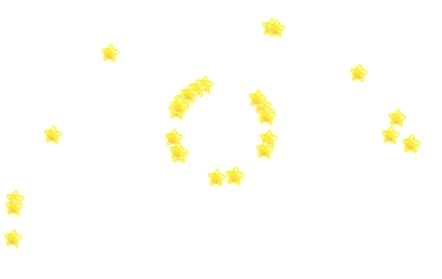
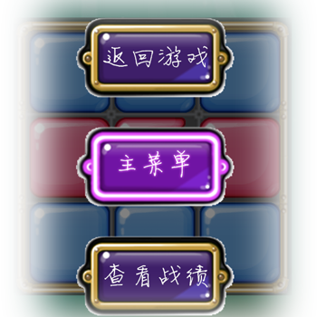

#综合实验
* * *

-  姓名：耿正霖 / 学号：2012013295
- 姓名：曾华 / 学号：2012013324

##游戏概况
- 游戏名称:**shift it**
- 游戏玩法：鼠标操作，使所有相同颜色的块都连通即可过关。
- 游戏启动：打开文件夹搭建本地服务器。例如输入命令。
    `python -m SimpleHTTPServer`
然后打开浏览器输入localhost即可开始游戏。
- github链接：`http://gengzhenglin.github.io/`
- 游戏参考：ios端游戏Shift it
- 

##代码组织
我们自己编写的JS代码

    gameinit.js——游戏初始化
	gameDrawBlock.js——绘制Block
	gameDrawEffect.js——绘制特效
	gameevent.js——游戏事件
	gamelogic.js——游戏逻辑
	gameover.js——游戏结束
	gamewidget.js——游戏部件
	fundament.js——基础
	sound.js——音效控制
使用的第三方JS代码

	jquery.js
	particle.js——粒子系统的绘制

我们自己编写的CSS代码

	style.css
	menu.css

我们自己编写的HTML代码
	
	index.html——主菜单页面
	game.html——游戏页面

##游戏特色

###精心绘制的Blocks图像
Blocks使用HTML5的canvas进行绘制。为了实现更好的用户体验，实现更好的游戏**效果**，我们没有使用纯色填充那种敷衍了事的做法，而是使用光照渲染过的.tga文件（取材于ios游戏Shift it）在Photoshop中重新制作成.gif。由于我们的游戏中每个Block分为上下左右四个部分，四个部分颜色可能不同，我们也没有直接用四块等腰三角形敷衍了事，颜色相同的三角形会相连起来。如图所示：

实际我们在绘图的时候采用的是如下的图，游戏加载的时候动态的计算每一种样式的Block在图片中的位置，为17中样式分别命名，然后绘制的时候将需要的block重叠绘制。这样形成的Block比纯色填充的不知道复杂到哪里去。

###精心设置的Block运动动画
为了增强程序的鲁棒性，我们不能允许用户进行任意的拖动，用户拖动以后Block要能自动运行到合法位置。这个运行过程我们也没有用简单的重绘页面制作，而是精心制作了动画，增强游戏感受，增加游戏过程**流畅性**（为了用户体验，这个动画设置的速度比较快，不仔细观察看不出来）。为了能够知道动画结束的时间，我们又采用了JS的自定义事件机制，在动画结束的时候trigger一个自定义事件，然后才进行下一步的绘制。

###游戏的撤销按钮
玩家每进行一步拖动，我们会分析拖动的offset，将其转化为一个拖动步骤，压入步骤堆栈中，然后根据这个拖动步骤重置后台逻辑中的色块矩阵。当用户执行撤销操作的时候，会根据步骤堆栈栈顶元素取反，进行撤销操作，我们的撤销操作同样适用的是动画而不是重绘，都是为了提升用户体验。使游戏**效果**更好。

###游戏的过关动画
当玩家过关之后会有一个过关动画，使用jQuery的`slideDown`和`slideUp`为页面添加遮罩效果，使用jQuery的`animate`移入移出彩弹。都是为了提升用户体验。使游戏**效果**更好。

###精致的canvas帧动画
过关的星星使我们每50ms绘制一帧，自己实现的帧动画。

###精心制作的粒子系统
我们采用粒子系统绘制星星播撒的动画，绘制的过程中每次向随机方向发射20颗星星，为星星提供一定的初速度和重力加速度，每30ms重绘一帧，每20帧重新发射一次粒子。粒子系统的代码参考自`http://www.cnblogs.com/miloyip/archive/2010/06/14/1758272.html`。但是原网站的代码有问题，而且和我们想要的效果也想去甚远，我们在仔细研读源代码的基础上把源代码中能改的部分几乎改了个遍。都是为了提升用户体验。使游戏**效果**更好。

###带碰撞的粒子系统
当通关的时候会有通关页面，通关页面同样使用粒子系统绘制出焰火的效果。我们增加了边界**碰撞**的效果，粒子的颜色采用两边界点颜色的线性插值。同时我们实现了动态模糊的效果，每30ms绘制一帧，每帧会在原有的基础上绘制一个alpha通道为0.1的黑色矩形，这样便实现了动态模糊。都是为了提升用户体验。使游戏**效果**更好。

###本地数据存储
我们使用了HTML5的localStorage特性实现游戏数据本地存储，这样玩家在刷新或是关闭网页之后还能回到之前玩的那关，**增强用户体验**。

###异步数据加载
本次游戏我们一共制作了36个关卡，如果把所有关卡在游戏开始的时候同时加载会有卡滞感，降低用户体验，所以我们活学活用进行**游戏优化**，使用ajax异步加载关卡数据。

###精彩的游戏素材
本次游戏虽然参考自IOS端游戏shift it，但是我们却没有什么好用的素材，为了能够达到不属于原始游戏的效果我们进行了大量的PS工作，除了背景图片，其他所有东西都是我们精心PS过的，**没有一样是直接拿来就能用的**。PS的工作时间几乎要与代码的工作时间持平。游戏的音频素材（背景音乐和鼠标移动到Block上的音效）使用HTML5的audio元素制作，增强游戏感受。

###游戏的总体评价
界面设计精致，尤其专注细节设计，整体来说从设计角度，游戏难度不算太难也不是太容易，使用Canvas绘图使游戏更加流畅。游戏工作量很大，无论是代码层面的还是图片素材层面的。

##技术难点

###游戏逻辑（判定是否可以过关）
对于一种颜色c，计算矩阵中完全由颜色c组成的第一个连通块的面积Sc，然后将所有Sc都相加起来，判断是否等于矩阵面积。这里用floodfill算法计算连通块的面积。

###Block事件绑定
- 在鼠标点击之后，为了实现拖拽效果，原有的mousemove事件需要全部进行清空，画布对应部分重新进行绘制。在mouseup事件发生之后进行重新绑定。
- 由于鼠标在Block上时会有阴影效果，但是这样当鼠标移出canvas画布的时候，就会留下一个Block残留阴影效果，所以添加mouseleave事件重新绘制画布。
- 如果用户鼠标拖动的时候在canvas内部施加mousedown事件但是拖到canvas外部才施加mouseup事件，canvas就捕捉不到mouseup事件会造成错误。这里我们将mouseup事件绑定到body上，利用JS的事件冒泡解决这一问题。

##分工
- 耿正霖：界面设计，制作，用户交互。
- 曾华：后台逻辑，关卡设计，index界面设计，游戏音效。

