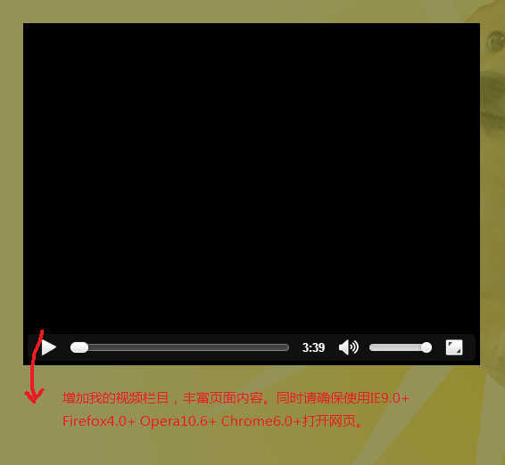

##个人主页说明文档##
- 姓名：耿正霖
- 学号：2012013295
- 邮箱：gzl8042@163.com
###页面header###

并非简单使用gif图片，同时利用CSS3许多有趣特性，加入doge元素，使页面协调美观，内容丰富，符合大多数人审美。

###导航栏###

使用导航栏使页面更为简单易用。

###个人介绍###
自我介绍详略得当，个人照片和信息使用了恰当方式进行公开，充分实现了任务的要求。同时，页面中使用各种各样的标签，丰富页面的样式和内容。

###web前端课程展示区###
使用表格的方式方便内容的排版和管理，同时使用CSS3特性改善用户交互体验。充分实现任务要求。

###个人日志###
利用HTML5特性使得日志标签可以折叠，有利于日志的归类和整理。日志部分放在个人页面显著地方，并且在第一篇日志中，集中表达了我个人对本课程的期待、对Web 前端的理解、对老师和助教想说的话等内容，充分实现任务要求。

###页面图片###
为图片添加形状，边缘，阴影等诸多特性，使页面更加美观，内容更加丰富。

###我的视频###
如果萌萌的doge不能满足你的话可以来看一看视频，丰富了页面内容。

###页面footer###
为页面增加彩弹，充分从用户角度出发，提升网页魅力质量。
